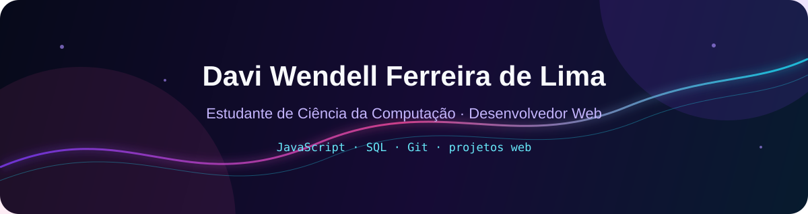

  

  

    
    
  

## Sobre mim

Sou estudante de Ciência da Computação e desenvolvedor web. Trabalho com **JavaScript, SQL e Git** e uso este perfil para reunir projetos acadêmicos, experimentos e produtos em desenvolvimento.

Também sou sócio na [Castro Compny](https://github.com/castrocompny).

## Projetos em destaque

<table>
  <tr>
    <td width="50%" valign="top">
      <h3><a href="https://github.com/castrocompny/Nauticflow">Nauticflow</a></h3>
      
Gestão inteligente para o turismo náutico.

      
    </td>
    <td width="50%" valign="top">
      <h3><a href="https://github.com/kauanleandr/Domingo-fast">Domingo-fast</a></h3>
      
Projeto acadêmico de sistema para fast food.

      
    </td>
  </tr>
  <tr>
    <td width="50%" valign="top">
      <h3><a href="https://github.com/DAVIWENDELL/Geolume">Geolume</a></h3>
      
Plataforma web SaaS de geoprocessamento automatizado.

      
    </td>
    <td width="50%" valign="top">
      <h3><a href="https://github.com/castrocompny/toursflow">toursflow</a></h3>
      
Projeto selecionado para destaque da Castro Compny.

      
    </td>
  </tr>
</table>

## Tecnologias presentes nos meus projetos

  
  
  
  
  
  
  
  

## Áreas de interesse

- Desenvolvimento web;
- Automação de processos;
- Produtos digitais;
- Geoprocessamento aplicado a aplicações web.

  Este README apresenta apenas experiências, tecnologias e projetos identificáveis neste perfil.

